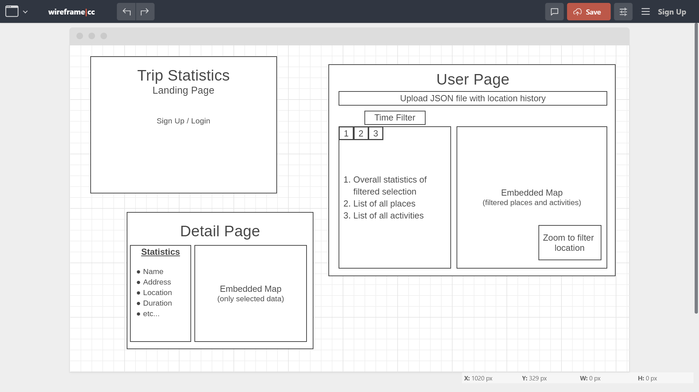

# Trip Statistics

[**Trip Statistics**](https://tripstatistics.herokuapp.com/) is a site where you can analyze your [Google Maps Location History](https://takeout.google.com/settings/takeout) data and see an overview of where you visited and what you did on your last trip!

## Links

- [Live site on Heroku](https://tripstatistics.herokuapp.com/)
- [Back end GitHub repository](https://github.com/spk2dc/TripStatistics_Backend)
- [Download Google Maps Location History data ](https://takeout.google.com/settings/takeout)

## Technologies

- React Frontend
- Python Flask (backend micro web framework)
- SQLite3 / PostgreSQL Databases
- Node
- JavaScript
- HTML
- CSS
- Bootstrap

## Features

- Google Maps API Integration
- Event listeners and handlers
- jQuery & Document Object Model (DOM) manipulation
- Asynchronous JavaScript with async and await
- User information storage and password encryption using Flask Bcrypt
- User sign up and log in functionality

## Wireframe

## Future Improvements

- Display activity paths on embedded map
- Upload and analyze files of any size
- Filter trip data by time and location
- Ability to share and send trip statistics to friends
- Create trip reports of longest visit, most visited, furthest, time traveling, total distance, etc.
- Pull Google Maps location history data from account with sign-in authorization instead of requiring a JSON file upload

##### Author/Developer:

[Senthil Kannan](https://github.com/spk2dc)

##### Last Updated: 8/19/2020
